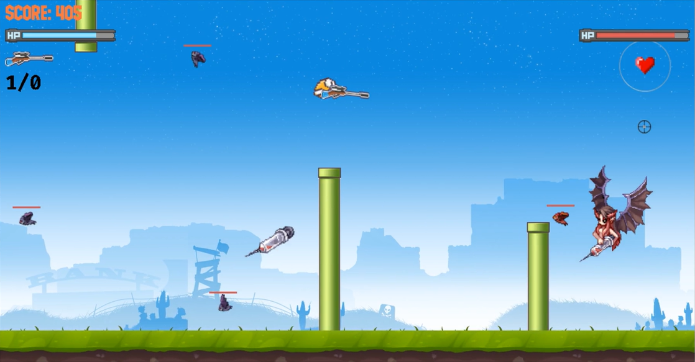
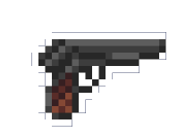
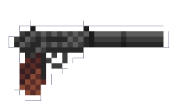
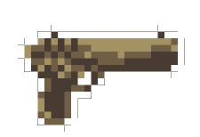
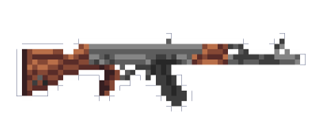
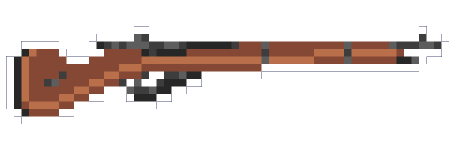
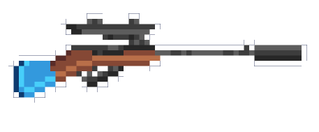
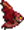
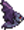
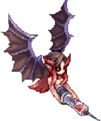

# Gun-Bird - A small game made with C++ and SDL2.

    <strong> Gun-Bird C++/SDL2 Game by Nguyen Manh Cuong. </strong>

 <strong>Author</strong>: Nguyen Manh Cuong

 <strong> Student ID </strong>: 23020016

- [0. Introduction](#0-introduction)
- [1. Preview](#1-preview)
- [2. Building And Running](#2-building-and-running)
- [3. How to play](#3-how-to-play)
- [4. Parameters](#4-parameters)
  * [A. Guns](#a-guns)
  * [B. Recovery Items](#b-recovery-items)
  * [C. Characters](#c-characters)
- [5. Controls](#5-controls-included-in-the-tutorial-of-the-game)
- [6. Scoring method](#6-scoring-method)
- [7. Sources](#7-sources)
- [8. Conclusion](#8-conclusion)
- [9. A Special Thanks](#9-a-special-thanks-to)

# 0. Introduction
Đây là game được em viết trong khoảng **6 tuần** và cũng là game đầu tiên mà em viết. Mong mọi người sẽ thích nó!

Các thư viện đi kèm: **SDL2**, **SDL2-image**, **SDL2-ttf** và **SDL2-mixer**.

# 1. Preview

# 2. Building And Running
  - Chạy file **main.exe** để chơi hoặc
  - Sử dụng [MinGW-w64](https://www.mingw-w64.org/) và các thư viện [SDL2](https://www.libsdl.org/) đi kèm để build file **main.cpp**. Chạy file vừa build được để chơi.
# 3. How to play
Né các vật thể: **Dơi**, **Ống**, **Boss**. Chạm phải các vật thể này sẽ bị trừ đi **1 máu** và được miễn nhiễm sát thương trong **2s**.

Bắn rơi **Dơi**, **Boss** và dành được điểm cao nhất có thể.

Ăn thêm các vật phẩm cần thiết để hỗ trợ cho màn chơi.

**Boss** xuất hiện sau mỗi lần bắn rơi **5** con **Dơi** kể từ khi Game bắt đầu hoặc **Boss** lần cuối bị hạ gục.

Mỗi lần hạ gục **Boss**:
  - Số máu MAX sẽ được tăng lên **1**.
  - Số máu hiện tại sẽ được hồi đầy.
  - **Boss** sẽ được cộng thêm **30** máu cho các lần sau.
  - Tốc độ game sẽ được tăng lên.
# 4. Parameters
## A. Guns
| Súng                                                | Sức mạnh | Số đạn mỗi Băng |
|-----------------------------------------------------|----------|-----------------|
|        | 3        | 7               |
|  | 3        | 30              |
|    | 30       | 1               |
|         | 5        | 30              |
|        | 10       | 8               |
|       | 15       | 5               |

## B. Recovery Items
| Vật phẩm                                          | Tác dụng                                                       |
|---------------------------------------------------|----------------------------------------------------------------|
|  | Hồi lại từ 1 -> 4 máu                                          |
|  | Cho một lớp giáp tương đương với một lần miễn nhiễm sát thương |

## C. Characters
| Nhân vật                                                                                    | Tên                 | Số máu                                 |
|---------------------------------------------------------------------------------------------|---------------------|----------------------------------------|
|                                              | **Main Bird**       | 5 + **Số Boss đã tiêu diệt được**      |
|   | **Bat/ Purple Bat** | 12                                     |
|                                                 | **Boss**            | 100 + 30 x **Số Boss đã bị tiêu diệt** |

# 5. Controls (Included in the Tutorial of the Game)
  - Di chuyển: **A**, **D** (trái phải).
  - Nhảy: **SPACE**.
  - Đổi súng: **Q**, **E**, **Lăn Chuột**.
  - Nạp đạn: **R**,
  - Bắn: **Chuột Trái**.
# 6. Scoring method
Khi **Boss** chưa xuất hiện, bắn rơi mỗi con **Dơi** được cộng **100đ**.

Khi **Boss** đã xuất hiện:
  - Bắn rơi mỗi con **Dơi** chỉ được cộng **5đ**.
  - Hạ gục **Boss** được cộng **2000đ/ 2^(Tổng số lần va chạm với Boss và skill của Boss)**.
# 7. Sources
Game được em tự viết hoàn toàn với một số tham khảo từ:
  - Game **Flappy Bird**.
  - Cách làm việc với SDL từ **LazyFoo**.
  - Một số thuật toán từ **ChatGPT**.

Tất cả các dữ liệu(bao gồm **Hình ảnh**, **Âm thanh**, **Font chữ**) đều được lấy miễn phí từ **Internet**.
# 8. Conclusion
Với tất cả những điều như trên thì em nghĩ Game này xứng đáng được **10đ**, nhưng nếu có thấp hơn thì em cũng xin chấp nhận. 
# 9. A Special Thanks To:
- **TS. Lê Đức Trọng** - Người hướng dẫn, Giảng viên.
- **CN. Trần Trường Thủy** - Người hướng dẫn, Giảng viên.
- **SV Nguyễn Hoàng Dương** - Cố vấn.